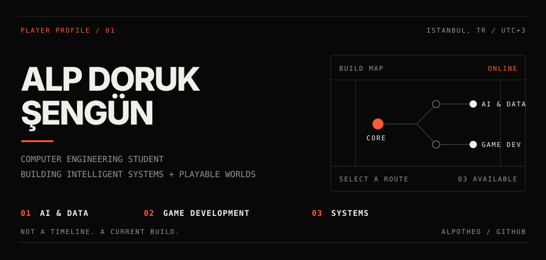
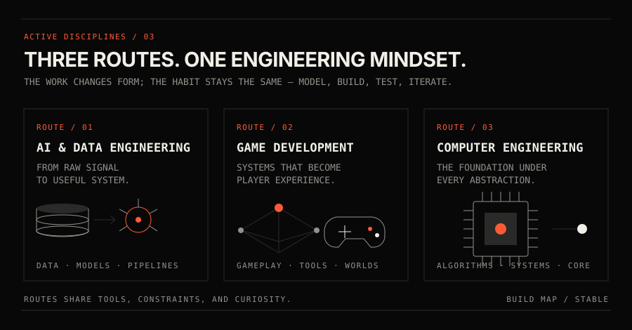
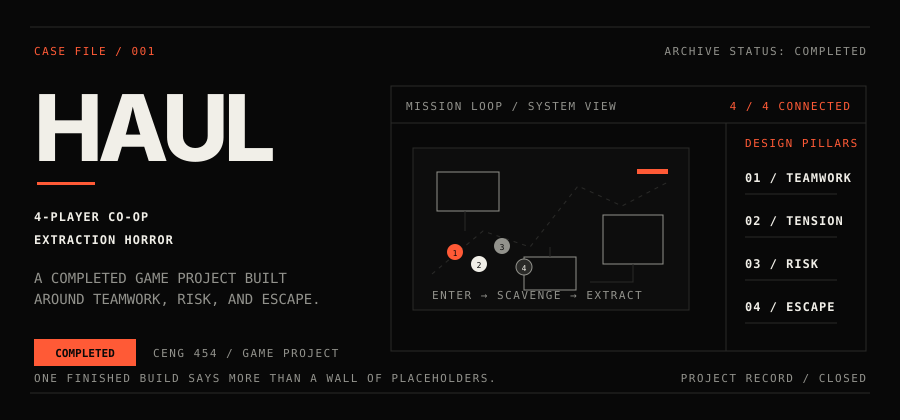
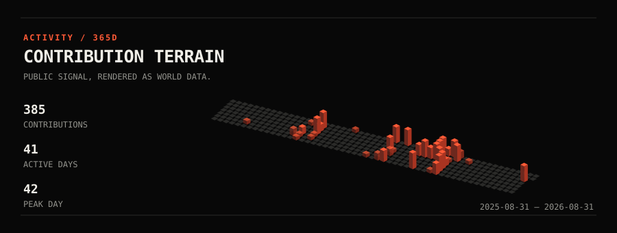

  

I study systems from both sides: how data becomes intelligence, and how engineering becomes an experience someone can play.

<code>PYTHON</code> / <code>C</code> / <code>JAVA</code> / <code>UNITY + C#</code> / <code>GIT</code> / <code>LINUX</code>

### Continue

[GitHub](https://github.com/AlpoTheo) · [LinkedIn](https://www.linkedin.com/in/alpsengun/) · [Email](mailto:alpotheo@gmail.com)

Selected repositories continue below this README ↓
